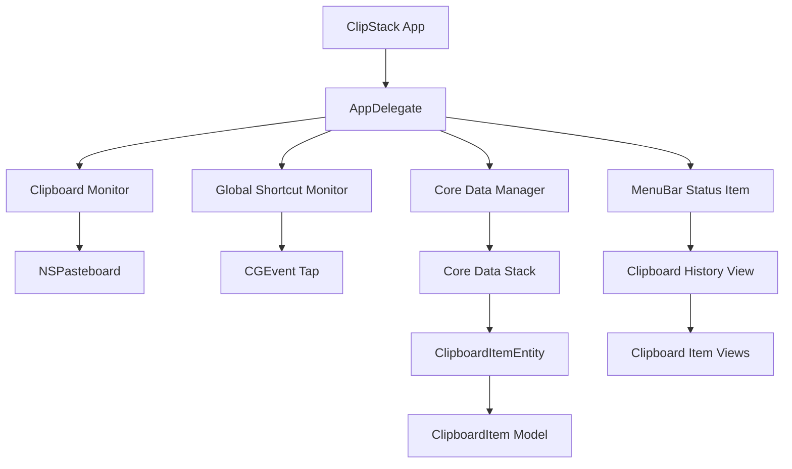

```mermaid
graph TD
    A[ClipStack App] --> B[AppDelegate]
    B --> C[MenuBar Status Item]
    B --> D[Clipboard Monitor]
    B --> E[Global Shortcut Monitor]
    B --> F[Core Data Manager]
    D --> G[NSPasteboard]
    E --> H[CGEvent Tap]
    F --> I[Core Data Stack]
    I --> J[ClipboardItemEntity]
    J --> K[ClipboardItem Model]
    C --> L[Clipboard History View]
    L --> M[Clipboard Item Views]
```